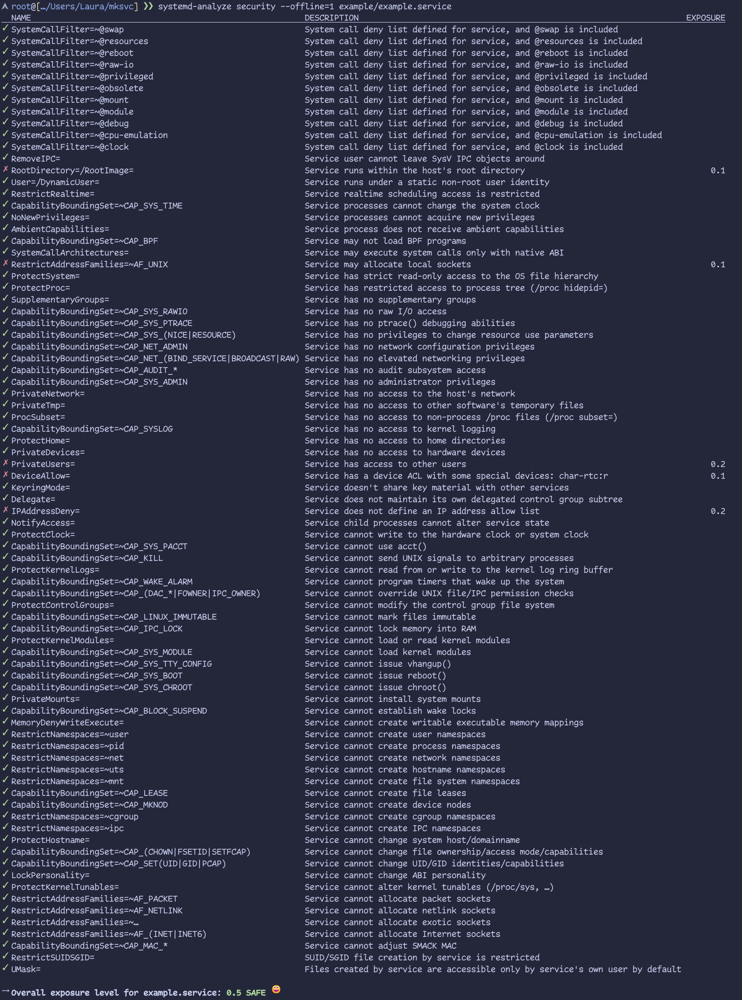

<picture>
  <source media="(prefers-color-scheme: dark)" srcset=".github/banner.svg">
  <source media="(prefers-color-scheme: light)" srcset=".github/banner-light.svg">
  
</picture>

A hardened, opinionated Systemd service generator for modern Linux deployments.

`mksvc` creates secure-by-default `.service` files that lock down the filesystem, network and kernel capabilities. It manages the full lifecycle of a service configuration: generating the unit file, creating a dedicated system user, configuring log rotation and generating a setup script; all while intelligently preserving manual customizations on subsequent runs.

## Installation

Download the latest binary and `checksums.txt` from the [Releases Page](https://github.com/coalaura/mksvc/releases) or install a verified prebuilt binary with one command:

```bash
curl -sL https://src.ws2.sh/mksvc/install.sh | bash
```

The shell installer supports Linux and macOS on amd64/arm64, using either `sha256sum` or macOS's `shasum -a 256`. macOS installations use the `wheel` group. Generation works on macOS and Windows too; the generated services and setup scripts target Linux/systemd.

## Usage

Run `mksvc` in the deployed service root. The path must be below `/opt`, `/srv`, `/var/lib` or `/usr/local/lib` and the executable must have the same name as the service.

```bash
# Generate configs interactively
mksvc my-app /opt/my-app -i

# Apply the configuration (requires sudo)
sudo bash conf/setup.sh
```

Setup makes the deployed executable and generated configuration root-owned. Run future regeneration as root from the same service directory, then rerun `conf/setup.sh`.

### Generated Artifacts

The tool creates a `conf/` directory containing:

1. **`my-app.service`**: The Systemd unit file (Hardened).
2. **`my-app.conf`**: Sysusers configuration to create the `my-app` user/group.
3. **`my-app_logs.conf`**: Logrotate configuration for file logging (omitted with `--journald`).
4. **`setup.sh`**: An idempotent script to install root-owned units, create users and configure log rotation.
5. **`uninstall.sh`**: Removes installed configuration and identities created by mksvc.
6. **`svc.yml`**: Saved configuration for subsequent runs.

### Logging

File logging remains the default. Standard output and error append to `logs/<name>.log` or `<name>.log` with `--no-log-dir`. Setup preserves existing log contents and rotates logs as root. The log directory is root-owned and cannot be modified by the service; the active log file is owned by `root:<service>` with mode `0660`, allowing the service to write its contents without replacing its pathname. Only that file, not the entire log directory, is writable inside the sandbox. Applications that create additional log files should use stdout/stderr instead.

The rotation policy is **daily or above 50 MiB** (`daily` plus `maxsize 50M`), retaining seven rotations, with compression delayed by one rotation. The host's existing logrotate job evaluates this policy; ensure it is enabled and includes `/etc/logrotate.d`. Size-based rotation only happens when that job runs, so a daily schedule cannot rotate earlier in the day when the log crosses 50 MiB. Configure the host's existing schedule more frequently if earlier size-based rotation is needed. This is a threshold, not a hard size cap. `copytruncate` preserves systemd's open log descriptor but can lose writes between copying and truncating. File logging requires logrotate; setup validates the configuration before stopping the application.

Use `--journald` to send stdout/stderr to the system journal instead. Interactive mode asks about journald first and only asks file-logging questions when it is disabled. This choice is saved in `conf/svc.yml`; `--no-journald` switches back to files.

```bash
mksvc my-app /opt/my-app --journald
sudo bash conf/setup.sh
journalctl -u my-app.service
```

Journald mode creates no log files or logrotate configuration and removes a stale generated `conf/<name>_logs.conf`. Setup removes an installed rotation rule bearing mksvc's ownership header, while leaving existing logs intact. If switching directly from an older release with an unmarked rotation rule, review and remove `/etc/logrotate.d/<name>` before running setup; setup refuses to remove an unrecognized rule automatically.

## Customization & Persistence

`mksvc` is designed to run repeatedly without destroying your work.

1. **Managed Keys**: Security attributes (e.g., `ProtectSystem`, `SystemCallFilter`) are owned by the tool and reset based on your configuration.
2. **Custom Keys**: `[Service]` supports `Environment`, `TimeoutStartSec`, `TimeoutStopSec` and `DeviceAllow`. `[Unit]` supports `After`, `Before`, `Requires`, `Wants`, `Requisite`, `BindsTo`, `PartOf` and `Conflicts`. `[Install]` preserves `WantedBy` and `RequiredBy`, including an explicitly empty install section. Unsupported unmanaged directives and sections are rejected instead of silently dropped.

The parser accepts `#` and `;` comments, continued logical lines, repeated sections and repeated assignments. Value syntax and per-key assignment order are retained so systemd applies its own quoting and reset rules; dependency assignments do not reset dependencies on an empty value. Logical lines are limited to 1 MiB. Tool-managed startup targets are recalculated on regeneration.

Restricted device access (`--devices`, without `--full-devices`) retains custom `DeviceAllow` rules and resets. If no rules were provided, it defaults to `char-usb rwm` and `char-tty rwm`. These are not general GPU/USB-serial profiles: add appropriate device paths/classes and arrange Unix permissions, for example through udev. Disabling devices or selecting full-device access removes the rules. An explicitly empty list remains closed rather than turning into full-device access.

`--writable-config` defaults to `config.yml`; use `--config-file=NAME` to select another file. This permits in-place writes, not temporary-sibling-and-rename saves, because the executable's parent directory stays read-only. `--writable` grants only `<path>/data`, not the entire working directory.

Use `--cpu-quota=`, `--memory-max=` or `--env-file=` to clear saved settings; omitting the flag keeps the previous value. Interactive prompts use Enter to keep a value and `-` to clear it. Positive fractional CPU quotas such as `0.5%` are supported. Environment files should be root-owned with mode `0600`: the system manager reads them before launching the service, so service-group readability is unnecessary.

Generation renders all outputs before publishing, serializes writers with an OS-held `conf/.mksvc.lock` and snapshots previous files in a private recovery journal. Ordinary publication failures roll back; after interruption, the next writing run restores the previous generation before loading settings. Each file uses same-directory native replacement; Windows never deletes the old file as a rename fallback. The set is recoverable rather than an atomic directory swap: do not run setup concurrently with generation. Leave the lock file in place; the OS releases its lock automatically. A remaining `.mksvc-recovery.json` is needed for recovery and can contain previous environment values. Dry-run refuses an outstanding recovery journal. Durability ultimately depends on the host filesystem; Unix directory changes are synced and Windows replacements request write-through.

### Example
If you manually add this to `conf/my-app.service`:

```ini
[Service]
Environment=API_KEY=12345
TimeoutStartSec=600
```

Running `mksvc` again will update the security sandbox settings but keep your `Environment` value and `TimeoutStartSec` override.

## Security Features

* **Filesystem**: Root is read-only (`ProtectSystem=strict`). Working directory is read-only by default.
* **Process**: No new privileges, restricted namespaces. Common executable directories are non-executable unless `--subprocess` is enabled, but remain readable. This is best-effort external-tool blocking, not a ban on child processes: threads, forks, self-reexecution and executables elsewhere remain possible.
* **Network**: Offline/Airgapped by default (`PrivateNetwork=yes`). Optional "Server Mode" for binding ports.
* **Kernel**: Logs, modules and tunables are protected. `/dev` is private.
* **Memory**: `MemoryDenyWriteExecute` enabled by default (`--exec-memory` opts out). `memfd_create` is denied independently unless `--memfd` is enabled for compatible IPC/JIT workloads; that exception reopens a documented executable-memory bypass. Some runtimes need both options.
* **Executable files**: Writable data/config/log/runtime locations, `/tmp`, `/var/tmp` and `/dev/shm` are non-executable even with `--subprocess`. Applications that load executable files or native libraries from those locations need a different deployment layout. Interpreters can still read scripts; this does not prohibit all code execution.
* **User namespaces**: `--private-users` maps root and the service UID/GID to themselves, with other IDs generally unmapped. It does not make the service UID 0.
* **Ownership**: Application code, installed policy and log directory entries remain root-owned. Only the active log file's contents, the optional `data` directory and an explicitly enabled application config file are service-writable.

### Example security analysis

The included `example/example.service` (default mksvc options) scores **0.5 (SAFE)** with `systemd-analyze security --offline=1`:


